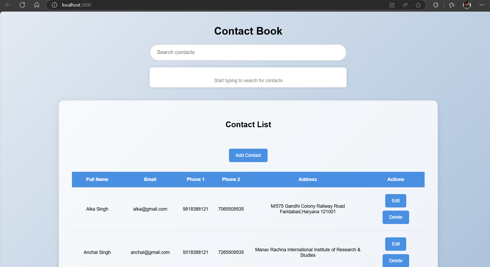
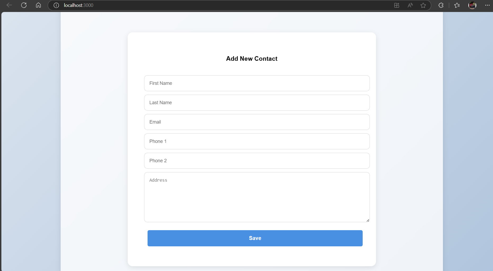
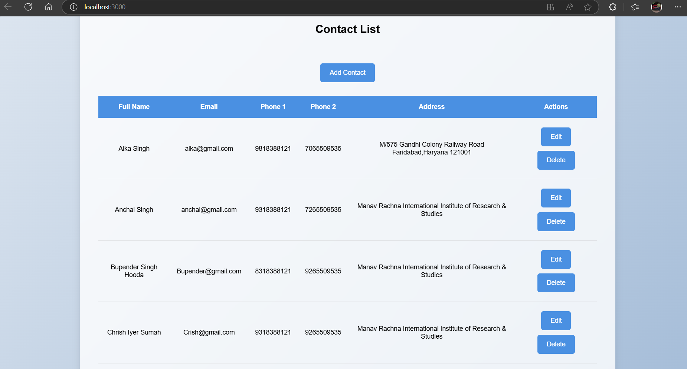
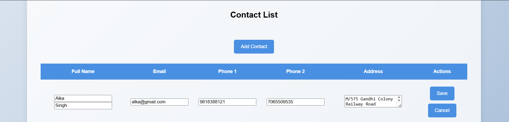
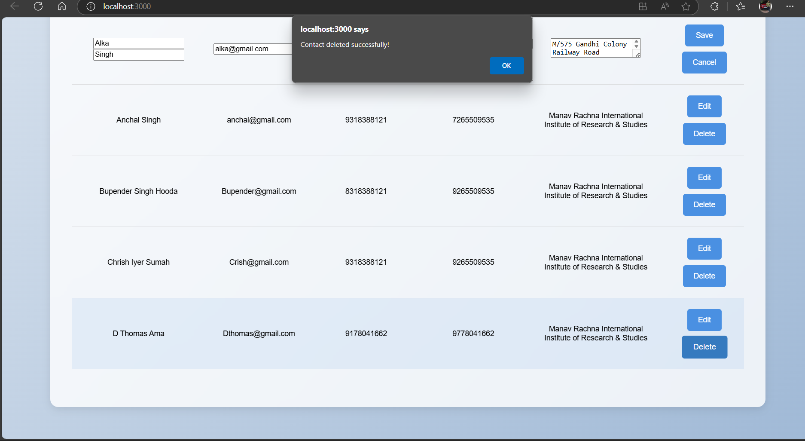
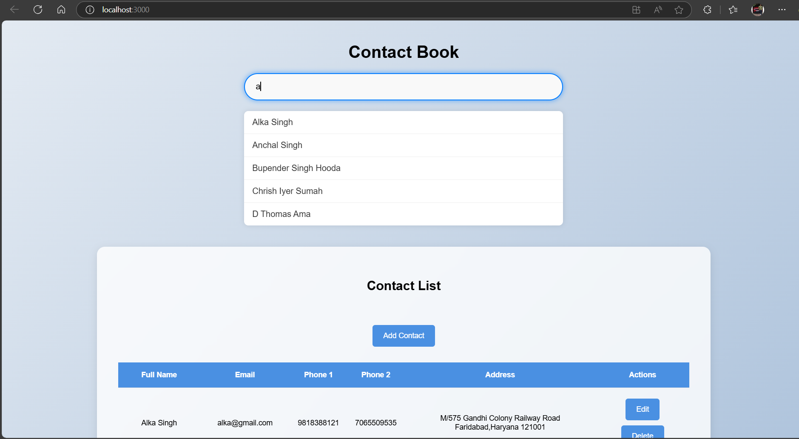
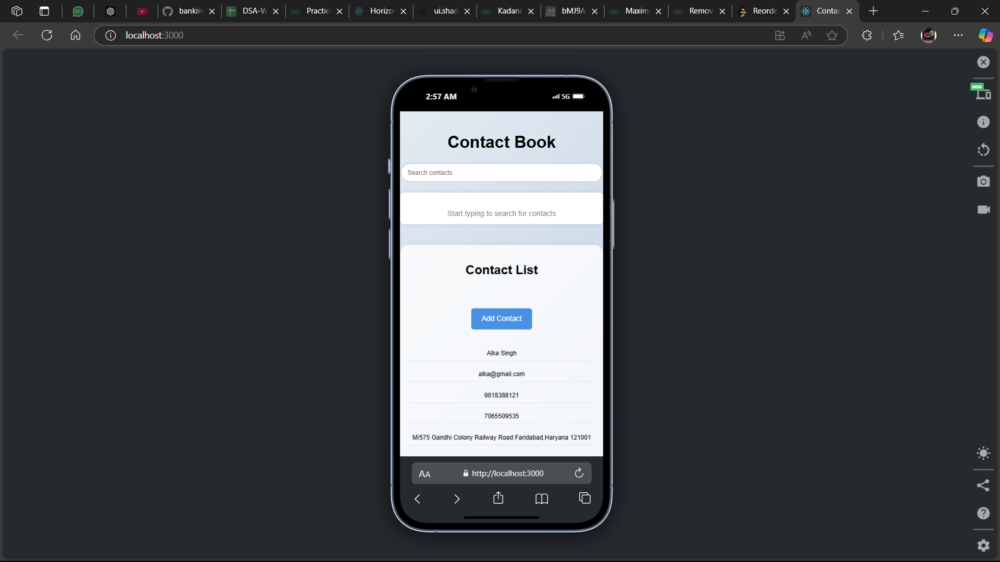

# Contact Manager


> A powerful and user-friendly **Contact Manager** web application that allows users to create, edit, delete, and search for contacts effortlessly. Built using **MERN Stack**, this application is the perfect solution for managing your contacts seamlessly.

---

## 🚀 Features

- **Add Contacts**: Effortlessly add new contacts with details like name, email, phone numbers, and address.
- **Search Functionality**: Quickly find contacts using a dynamic search bar.
- **Edit Contacts**: Update contact information easily.
- **Delete Contacts**: Remove unwanted contacts with a single click.
- **Sort Contacts**: Sort contacts by name or other attributes for easy management.

---

## 📹 Project Demo


---

## 🖼️ Screenshots

### Home Page



### Add Contact Form



### Contact List



### Edit Contact



### Delete Contact



### Search Contact



 ### Pagination 


 ### Responsiveness



---

## 🛠️ Technology Stack

### Frontend
- **React.js**: For building the user interface.
- **CSS**: For styling the application and enhancing its visual appeal.

### Backend
- **Node.js**: For server-side logic.
- **Express.js**: For creating the RESTful API.

### Database
- **MongoDB**: For storing contact details.

---

## 📦 Dependencies

### Backend Dependencies
- **Mongoose**: To connect and interact with MongoDB.
- **Express.js**: For building RESTful APIs.
- **Cors**: To handle cross-origin requests.

### Frontend Dependencies
- **Axios**: For making HTTP requests to the backend.
- **React Hooks**: For managing component state and lifecycle.

---

## 🧑‍💻 Installation & Setup

### Prerequisites
Make sure you have the following installed:
- Node.js
- MongoDB
- npm or yarn

### Steps
1. Clone this repository:
   ```bash
   git clone https://github.com/tushar07-debug/Intellewings-Project
   ```
2. Navigate to the project directory:
   ```bash
   cd Contact-Book
   ```
3. Install dependencies for both frontend and backend:
   ```bash
   cd client && npm install
   cd ../server && npm install
   ```
4. Start MongoDB server:
   ```bash
   mongod
   ```
5. Start the backend:
   ```bash
   cd Backend && npm start
   ```
6. Start the frontend:
   ```bash
   cd Frontend && npm start
   ```

---

## 📂 Folder Structure

```
contact-manager/
├── Frontend/                # React frontend
│   ├── src/
│   │   ├── components/   # React components
│   │   ├── App.js        # Main App file
│   │   ├── index.js      # Entry point
│   └── public/           # Public assets
├── Backend/                # Node.js backend
│   ├── routes/           # API routes
│   ├── models/           # Database models
│   └── index.js          # Main server file
└── Images/                # Screenshots and demo video
```

---

## 🛡️ Security Features
- Password protection for sensitive actions (optional).
- Validation for input fields to ensure clean data.

---

## 🛠️ Future Enhancements
- Add user authentication and roles.
- Implement pagination for contact lists.
- Enable importing/exporting contact data as CSV.

---

## 🤝 Contributing
We welcome contributions! Feel free to fork the repository and submit a pull request.

---

## 🧑‍🏫 Author

**Tushar Kumar Singh**  
Software Developer | MERN Stack Enthusiast  
[LinkedIn](https://www.linkedin.com/in/tushar--singh/) | [GitHub](https://github.com/tushar07-debug)

---

## 📄 License

This project is licensed under the MIT License. See the [LICENSE](./LICENSE) file for details.

---

Thank you for checking out this project! We hope you enjoy using the Contact Manager application. Happy coding! 🎉

