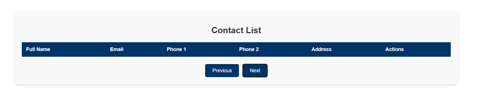

Contact Manager

A powerful and user-friendly Contact Manager web application that allows users to create, edit, delete, and search for contacts effortlessly. Built using MERN Stack, this application is the perfect solution for managing your contacts seamlessly.

🚀 Features

Add Contacts: Effortlessly add new contacts with details like name, email, phone numbers, and address.

Search Functionality: Quickly find contacts using a dynamic search bar.

Edit Contacts: Update contact information easily.

Delete Contacts: Remove unwanted contacts with a single click.

Sort Contacts: Sort contacts by name or other attributes for easy management.

📹 Project Demo

🖼️ Screenshots

Home Page

Add Contact Form

Contact List

Edit Contact

Delete Contact

Search Contact

Pagination 

Responsiveness

🛠️ Technology Stack

Frontend

React.js: For building the user interface.

CSS: For styling the application and enhancing its visual appeal.

Backend

Node.js: For server-side logic.

Express.js: For creating the RESTful API.

Database

MongoDB: For storing contact details.

📦 Dependencies

Backend Dependencies

Mongoose: To connect and interact with MongoDB.

Express.js: For building RESTful APIs.

Cors: To handle cross-origin requests.

Frontend Dependencies

Axios: For making HTTP requests to the backend.

React Hooks: For managing component state and lifecycle.

🧑‍💻 Installation & Setup

Prerequisites

Make sure you have the following installed:

Node.js

MongoDB

npm or yarn

Clone this repository:

git clone https://github.com/tushar07-debug/Intellewings-Project

Navigate to the project directory:

cd Contact-Book

Install dependencies for both frontend and backend:

cd frontend && npm install
cd ../backend && npm install

Start MongoDB server:

mongod

Start the backend:

cd server && npm start

Start the frontend:

cd client && npm start

📂 Folder Structure

contact-manager/
├── frontend/                # React frontend
│   ├── src/
│   │   ├── components/   # React components
│   │   ├── App.js        # Main App file
│   │   ├── index.js      # Entry point
│   └── public/           # Public assets
├── backend/              # Node.js backend
│   ├── routes/           # API routes
│   ├── models/           # Database models
│   └── index.js          # Main server file
└── assets/               # Screenshots and demo video

🛡️ Security Features

Password protection for sensitive actions (optional).

Validation for input fields to ensure clean data.

🛠️ Future Enhancements

Add user authentication and roles.

Implement pagination for contact lists.

Enable importing/exporting contact data as CSV.

🤝 Contributing

We welcome contributions! Feel free to fork the repository and submit a pull request.

🧑‍🏫 Author

Tushar Kumar Singh
Software Developer | MERN Stack Enthusiast
[Linkedin](https://www.linkedin.com/in/tushar--singh/) | [Github](https://github.com/tushar07-debug)

📄 License

This project is licensed under the MIT License. See the LICENSE file for details.

Thank you for checking out this project! We hope you enjoy using the Contact Manager application. Happy coding! 🎉